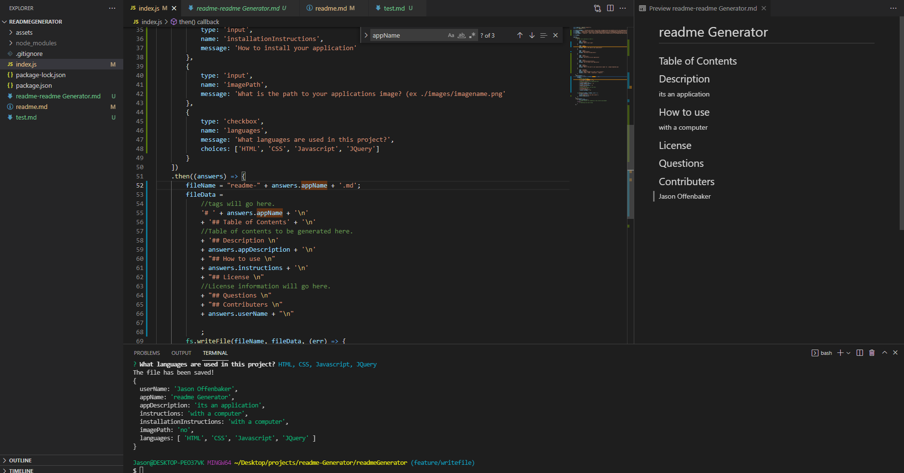

# Readme Generator
## Table of Contents
* [Description](#Description) 
* [How to use](#usage) 
* [Installing](#Installing) 
* [Contributing](#contribution) 
## Description 
creates a readme.md file based off of user inputs

## usage 
[Application in action](https://drive.google.com/drive/folders/15FsEZfNX-UMF0DXYf1a1TqqXJZbZowZ7?usp=sharing)
simply download and run the files then follow the onscreen instructions
## Questions 
## Contributers 
Jason Offenbaker
